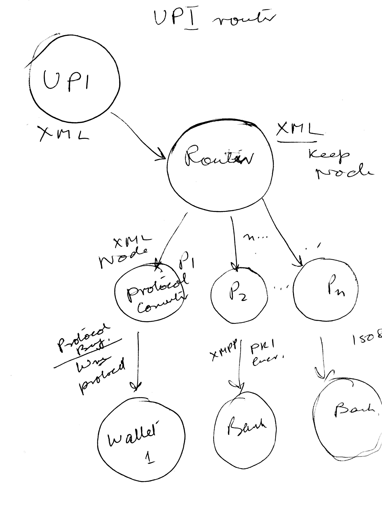

= UPI Router Design 
Ashish Banerjee <tech@innomon.in>
v0.1, 2016-07-10
:toc:

This document outlines Design and Architecture of UPI Router.

== Architecture 

.Section 4.3.2 Payment API of UNIFIED PAYMENT INTERFACE – VERSION 1.2, Feb 2016, Pg 30/107

"The PSPs maintain the PSP specific payment addresses which can be resolved to any of the common global addresses (Aadhaar
number, Mobile number, Account + Provider ID) that NPCI can understand"

Thus a routing table is needed for mapping `xpath` expression to the Server, Protocol, MMID + Mobile number.

.Configure Router(param1, "p2")
----
xpath: */xyz/@path
value:
proivder:
MMID:
xquery: //to transform xpath to MMID+Mobile

----

=== XPath and XQuery
http://blog.labix.org/2013/06/07/efficient-xpath-for-go[xpath blog]

https://www.w3.org/TR/xpath/[Xpath specs]

https://godoc.org/launchpad.net/xmlpath[xpath juju launchpad project]

https://en.wikipedia.org/wiki/XQuery[XQuery]

https://www.w3.org/XML/Query/[XQuery W3C Home]

http://labs.oreilly.com/[Xquery powered site]

https://www.w3.org/TR/2014/REC-xquery-30-20140408/[XQuery 3.0 Specs]

http://basex.org/[Java XQuery XML DB]

http://docs.basex.org/wiki/Main_Page[BaseX Documentation]

https://github.com/BaseXdb/BaseX

